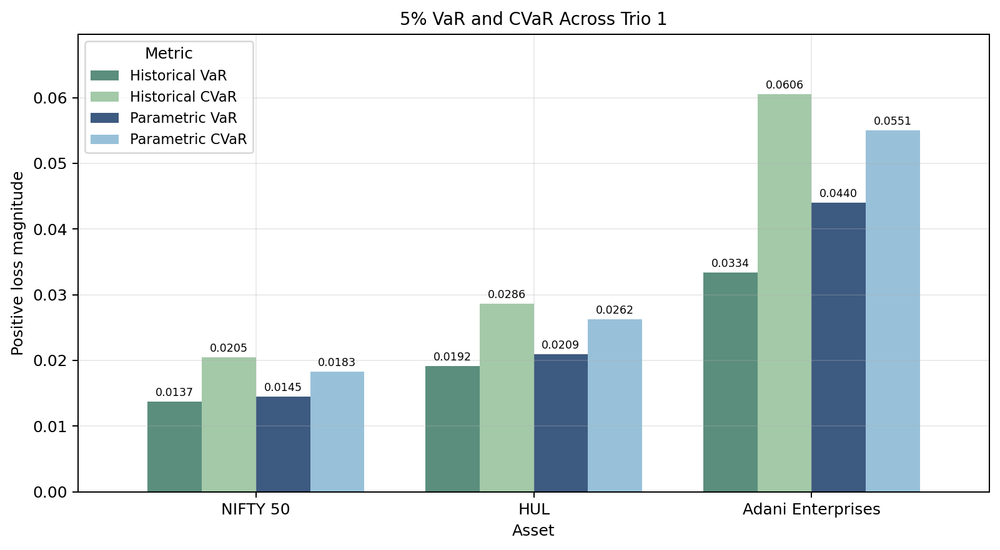

# CoVaR Analysis

This project studies downside tail risk using Value-at-Risk (VaR) and Conditional Value-at-Risk (CVaR). The goal is to compare how bad losses can become across different assets and time frequencies.

VaR gives a loss threshold at the 5% tail. CVaR goes one step further and estimates the average loss once that threshold is crossed.

The analysis focuses on:

- tail losses under historical data
- historical versus Gaussian parametric risk estimates
- cross-asset comparisons using VaR, CVaR, tail gap, and tail amplification

## Asset Trios

**Trio 1:** NIFTY 50, HUL, and Adani Enterprises  
This compares a diversified index, a stable defensive stock, and a volatile stock using daily returns.

**Trio 2:** HDFC Bank, HUL, and TCS  
This compares banking, FMCG, and IT sector stocks using weekly returns.

<!-- ## Site Roadmap

The site starts with the methodology, then highlights the strongest findings from each trio. The key insights page connects the two analyses, while the reproducibility page explains where the notebooks and shared risk metric code fit in.

This project focuses on comparing VaR and CVaR under historical and Gaussian assumptions. -->
