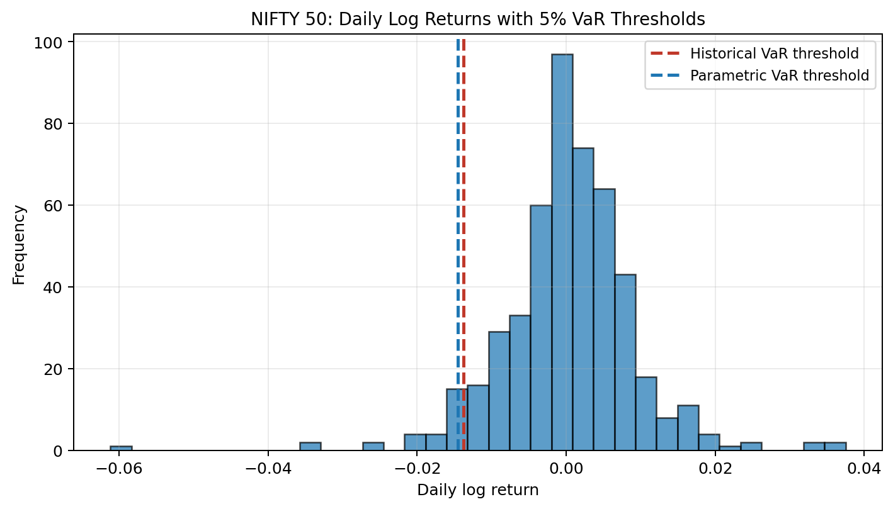
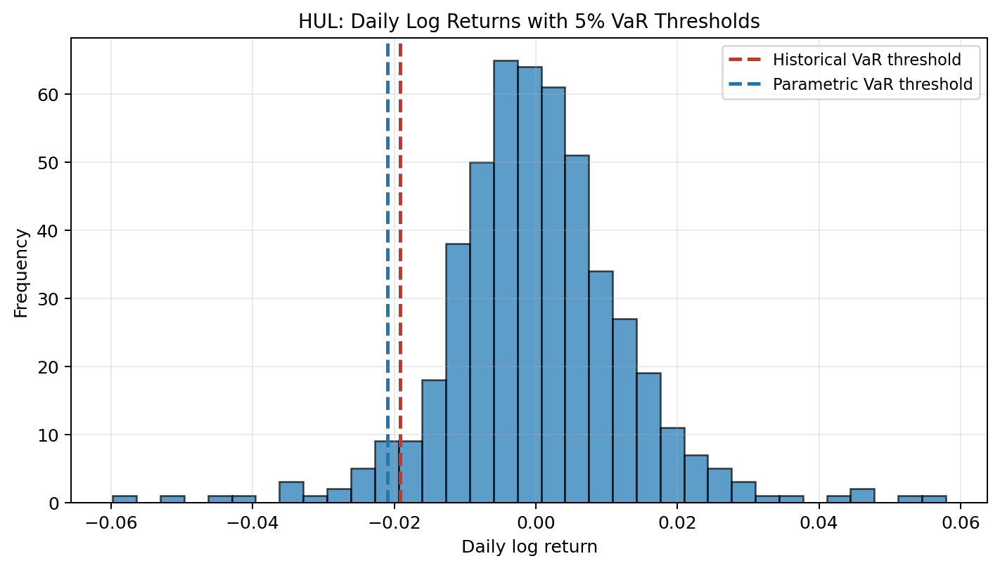
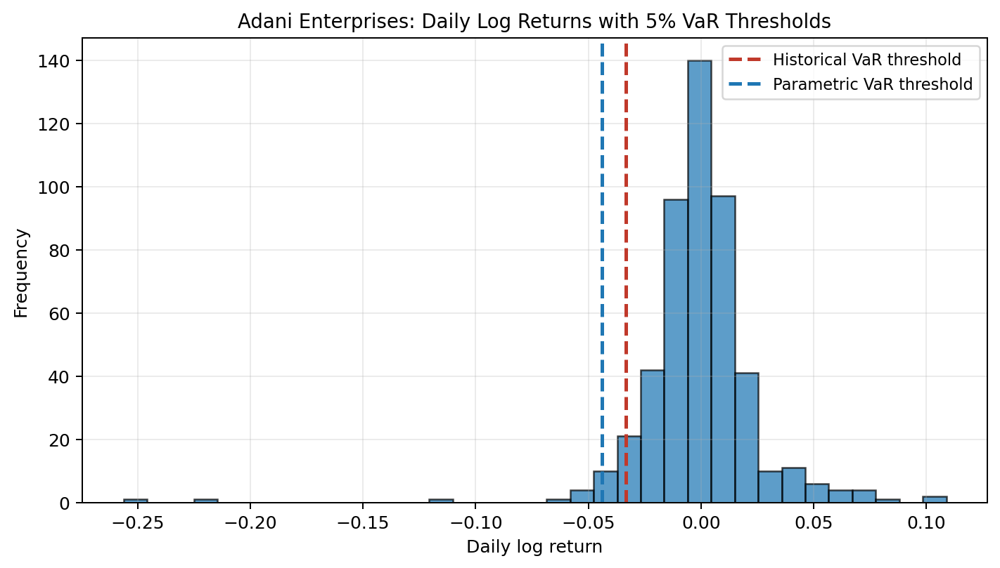
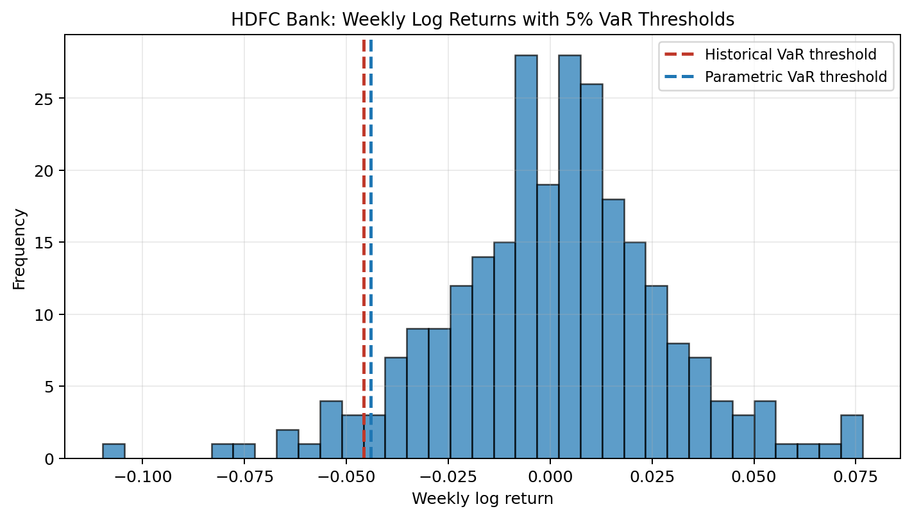
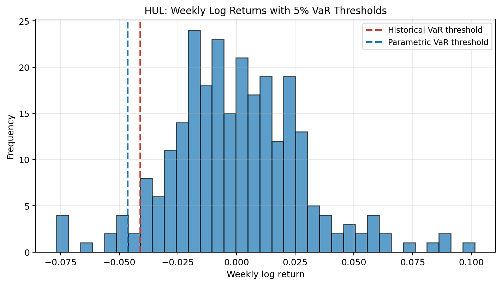
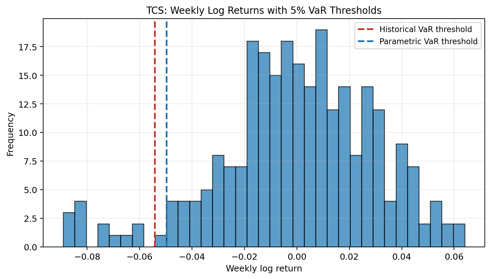

# Individual Asset Analysis

This page collects the per-asset analysis blocks from the two final notebooks. Instead of looking only at summary charts, each asset is shown on its own so the VaR threshold and tail behavior are easier to see.

In each histogram, the bars show the return distribution and the dashed lines show the historical and parametric VaR thresholds.

## Trio 1 Assets

Trio 1 uses **daily log returns** and compares a diversified index, a stable stock, and a volatile stock.

### NIFTY 50

- The 5% historical loss threshold is about **0.0137**, so the return-space cutoff is **-0.0137**.
- Historical CVaR is **0.0205**, which estimates the average loss after crossing that cutoff.
- The historical tail is **heavier than the Gaussian tail** based on CVaR (**0.0205** vs **0.0183**).
- Historical tail amplification is **1.49x**, meaning CVaR is that multiple of historical VaR.

NIFTY 50 is the benchmark case here. Its tail is present, but more contained than the individual stocks.

### HUL

- The 5% historical loss threshold is about **0.0192**, so the return-space cutoff is **-0.0192**.
- Historical CVaR is **0.0286**, which estimates the average loss after crossing that cutoff.
- The historical tail is **heavier than the Gaussian tail** based on CVaR (**0.0286** vs **0.0262**).
- Historical tail amplification is **1.49x**, meaning CVaR is that multiple of historical VaR.

HUL sits between the index and the volatile stock. Its tail is deeper than NIFTY 50, but still much more controlled than Adani Enterprises.

### Adani Enterprises

- The 5% historical loss threshold is about **0.0334**, so the return-space cutoff is **-0.0334**.
- Historical CVaR is **0.0606**, which estimates the average loss after crossing that cutoff.
- The historical tail is **heavier than the Gaussian tail** based on CVaR (**0.0606** vs **0.0551**).
- Historical tail amplification is **1.81x**, meaning CVaR is that multiple of historical VaR.

Adani Enterprises is the clearest Trio 1 example of why CVaR matters. The VaR cutoff is already large, but the average loss after entering the tail becomes much worse.

## Trio 2 Assets

Trio 2 uses **weekly log returns** and compares banking, FMCG, and IT stocks.

### HDFC Bank

- The 5% historical weekly loss threshold is about **0.0458**, so the return-space cutoff is **-0.0458**.
- Historical weekly CVaR is **0.0631**, which estimates the average weekly loss after crossing that cutoff.
- The historical weekly tail is **heavier than the Gaussian tail** based on CVaR (**0.0631** vs **0.0553**).
- Historical tail amplification is **1.38x**, meaning CVaR is that multiple of historical VaR.

HDFC Bank represents the banking case in the weekly comparison. Its tail is clearly visible, and the historical estimate suggests the downside goes deeper than the Gaussian view implies.

### HUL

- The 5% historical weekly loss threshold is about **0.0411**, so the return-space cutoff is **-0.0411**.
- Historical weekly CVaR is **0.0579**, which estimates the average weekly loss after crossing that cutoff.
- The historical weekly tail is **not heavier than the Gaussian tail** based on CVaR (**0.0579** vs **0.0583**).
- Historical tail amplification is **1.41x**, meaning CVaR is that multiple of historical VaR.

HUL looks comparatively stable in this trio as well, but the weekly tail is still meaningful. It works as the more defensive reference point in the sector comparison.

### TCS

- The 5% historical weekly loss threshold is about **0.0543**, so the return-space cutoff is **-0.0543**.
- Historical weekly CVaR is **0.0776**, which estimates the average weekly loss after crossing that cutoff.
- The historical weekly tail is **heavier than the Gaussian tail** based on CVaR (**0.0776** vs **0.0623**).
- Historical tail amplification is **1.43x**, meaning CVaR is that multiple of historical VaR.

TCS shows a deeper weekly tail than HUL and helps make the sector comparison more concrete. Here again, CVaR adds information that VaR alone does not capture fully.
