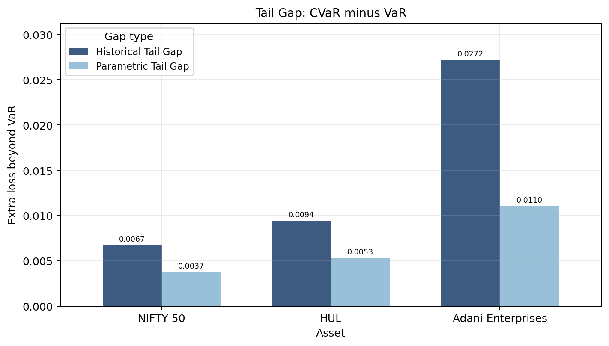
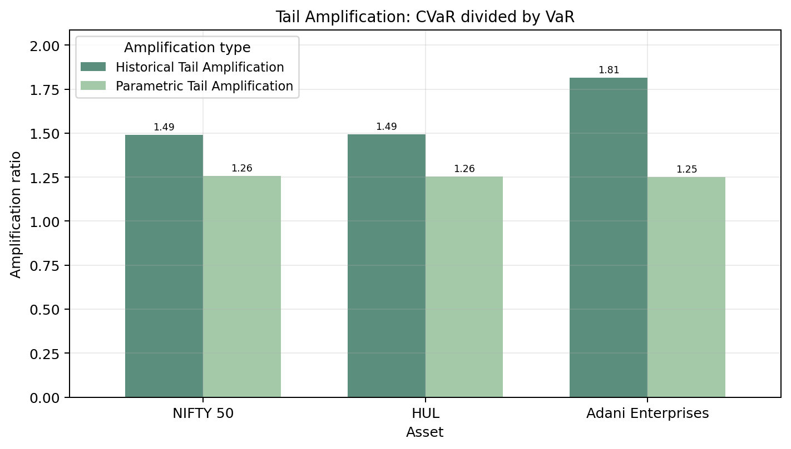

# Trio 1 Highlights

Trio 1 compares a diversified market benchmark, a stable defensive stock, and a volatile stock:

- NIFTY 50: diversified index
- HUL: stable / defensive stock
- Adani Enterprises: volatile stock

The aim is to see how tail risk changes when moving from broad market exposure to individual stock exposure.

Trio 1 is used as a direct test of the project statement: compare VaR and CVaR for assets with different risk profiles, examine how losses deepen beyond the VaR threshold, and show why CVaR becomes more informative when tail risk is strong.

## VaR and CVaR Comparison

This comparison is the first step in extending the analysis from VaR to CVaR. Adani Enterprises shows the strongest downside tail risk in this trio, HUL lies between the index and Adani, and NIFTY 50 is relatively contained because diversification reduces the depth of the tail.

## Tail Gap

The tail gap shows how much worse average tail losses become after the VaR threshold is crossed. This is where the extreme-tail-loss part of the project becomes clearer: a larger gap means VaR alone misses more of the severity inside the tail.

## Tail Amplification

Tail amplification gives the relative version of the same idea. It helps compare whether CVaR is much larger than VaR for each asset, even when the absolute risk levels differ, so it strengthens the VaR-versus-CVaR comparison.

## Adani Tail Shape

Adani’s return distribution makes the tail result easier to see visually. In the most volatile asset, CVaR becomes especially useful because the loss severity inside the tail can be much worse than the VaR cutoff alone suggests. The historical tail can also differ from the Gaussian estimate, which is why both views are included.
