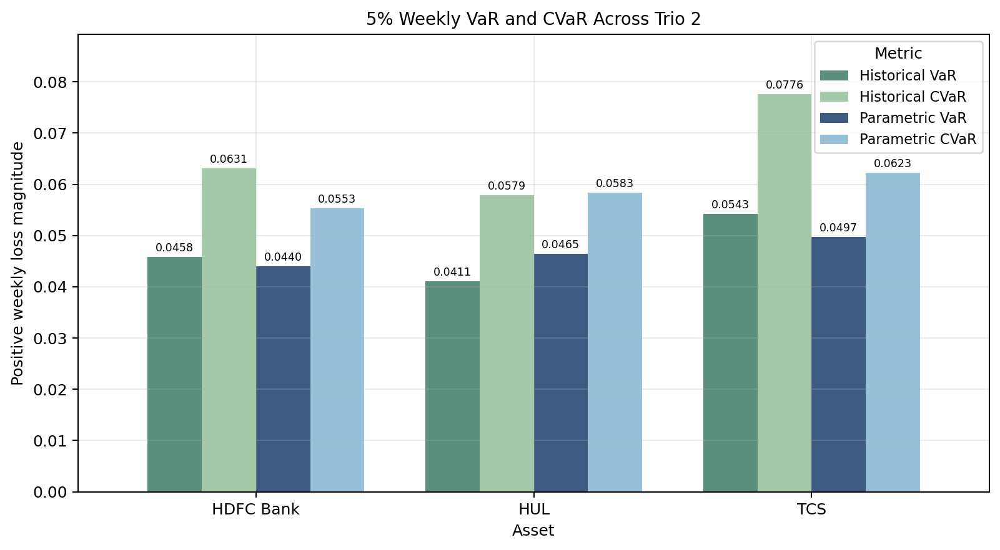
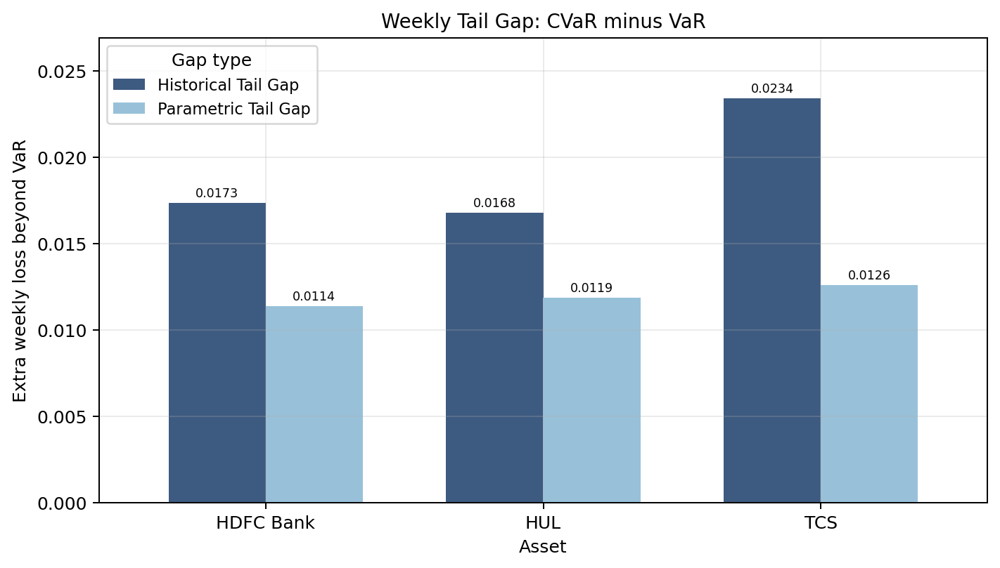
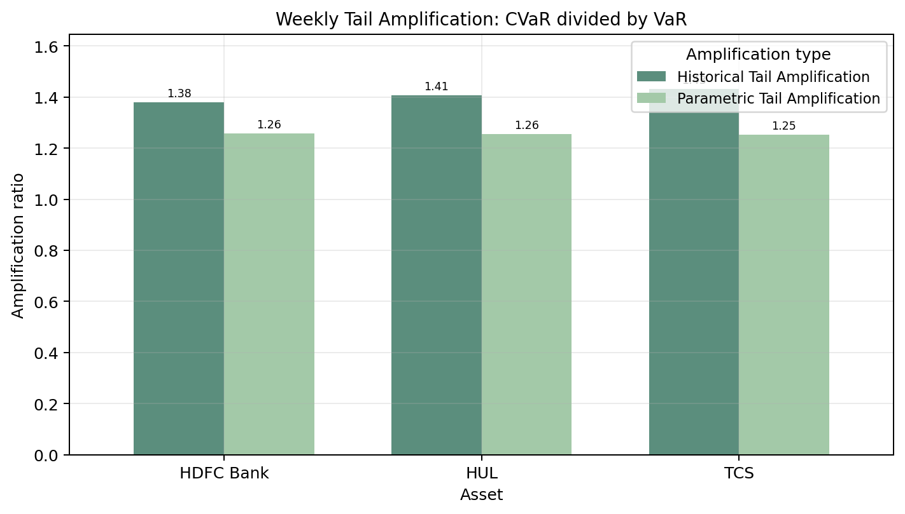
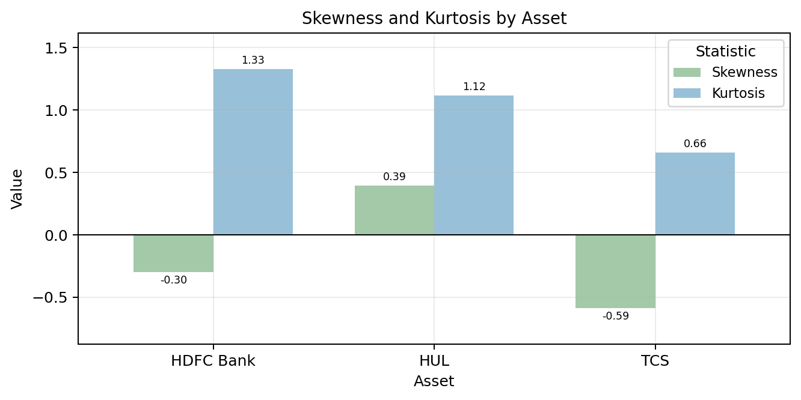

# Trio 2 Highlights

Trio 2 compares weekly downside risk across three sector stocks:

- HDFC Bank: banking stock
- HUL: FMCG stock
- TCS: IT stock

The source data is daily, but the analysis uses weekly prices and weekly log returns.

Trio 2 acts as a weekly sector-level test of the same project tasks: extend VaR to CVaR, study extreme tail losses, and compare how the two measures behave across different types of large stocks.

## Weekly VaR and CVaR Comparison

This chart compares the weekly downside threshold and the weekly average tail severity across the three sectors. It is the main view for seeing how the VaR-to-CVaR extension changes the reading of downside risk at the sector-stock level.

## Weekly Tail Gap

Tail gap shows the extra weekly loss beyond the VaR cutoff. It is useful because two assets can have similar VaR values but different loss severity after the cutoff, which is exactly the kind of extreme-tail difference the project is trying to measure.

## Weekly Tail Amplification

Tail amplification compares CVaR relative to VaR. This makes the weekly tail depth easier to compare across banking, FMCG, and IT stocks even when their overall risk levels are not identical.

## Skewness and Kurtosis

Skewness and kurtosis help explain whether the return distribution supports the VaR/CVaR findings. High kurtosis or negative skewness can support the idea that extreme downside moves are important enough that CVaR adds useful information beyond VaR.
